##  Unit 12—Tales from the Crypto
### News Headlines Sentiment

#### BTC

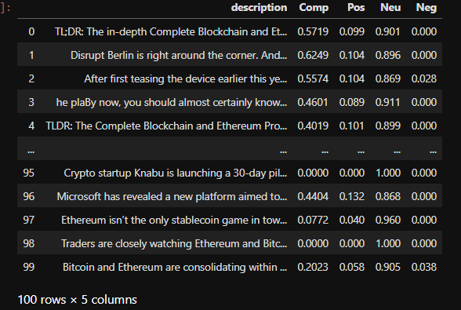

####  ETH

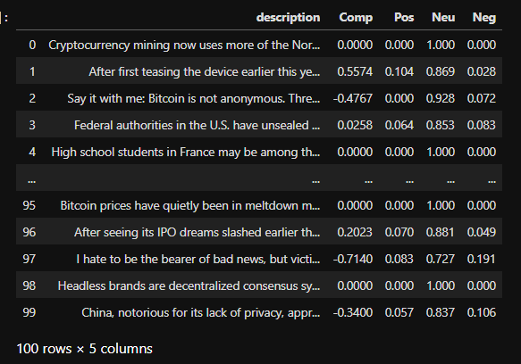

#### Combined Stats

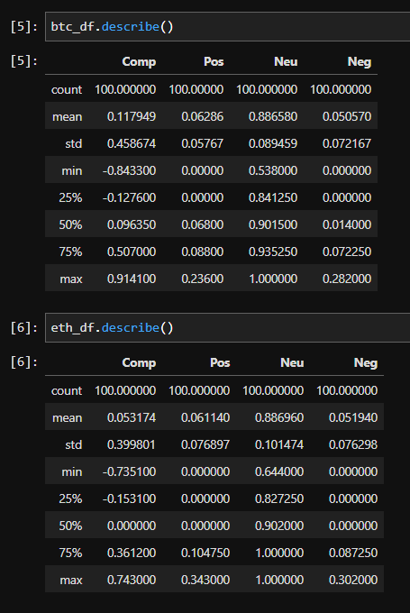

1. Which coin had the highest mean positive score?
* BTH 0.06286

2. Which coin had the highest negative score?
* ETH 0.302000

3. Which coin had the highest positive score?
* SMOTE 0.65

## Natural Language Processing
#### Tokenized Text

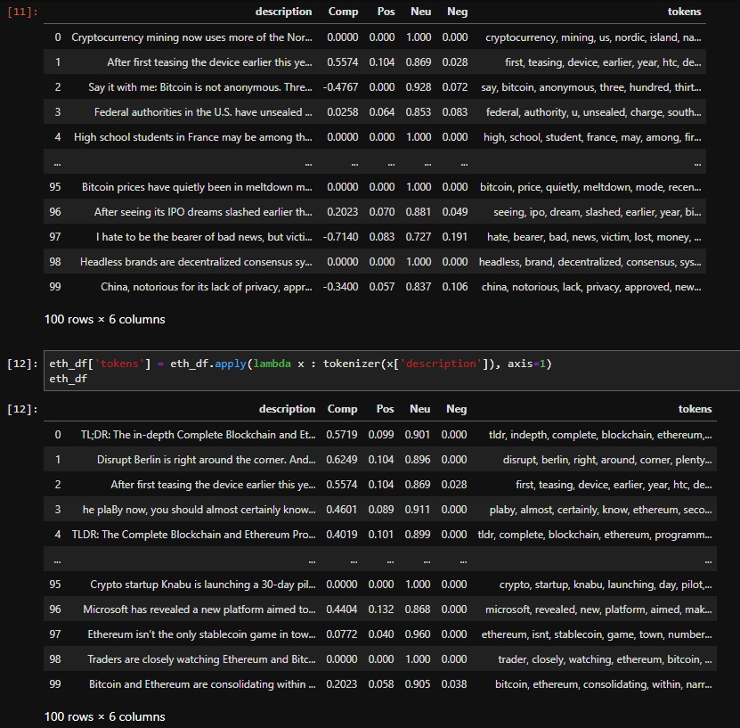

#### Bigrams

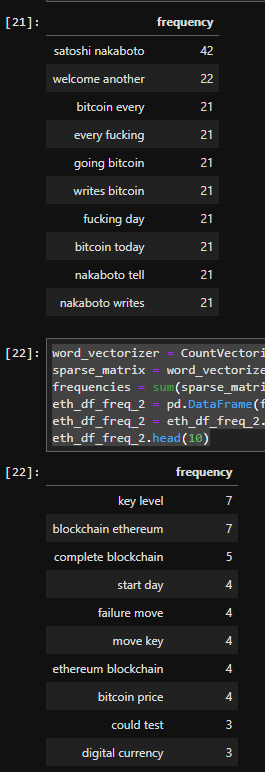

#### Unigrams

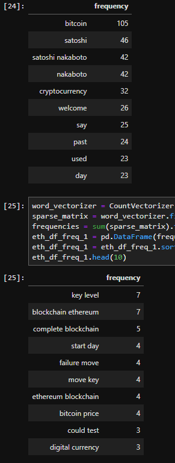

#### Word Clouds

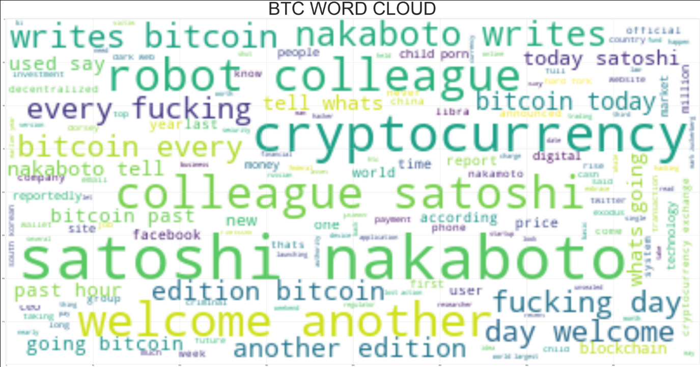

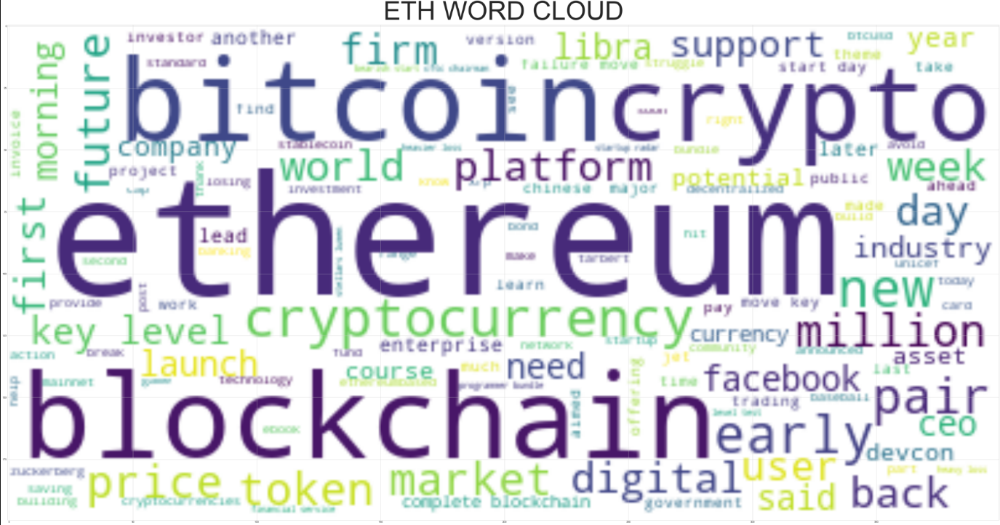

#### BTC NER Cloud

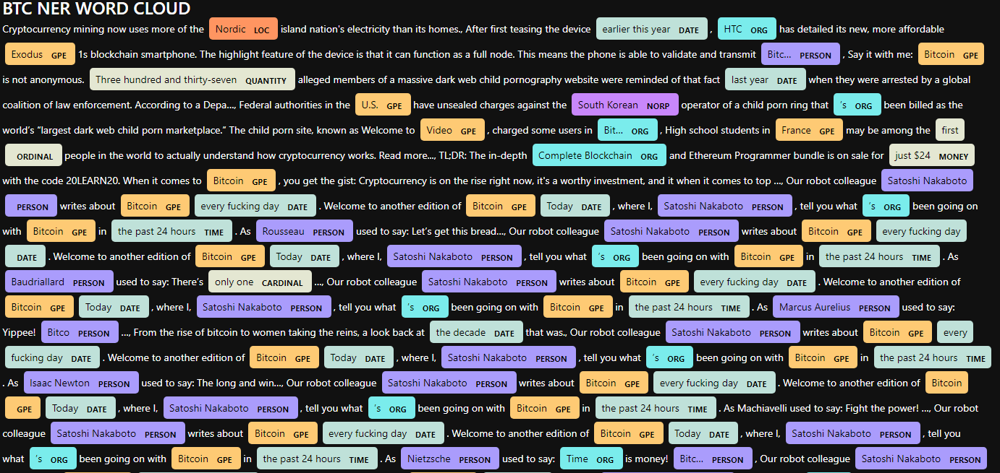

#### BTC Entities List

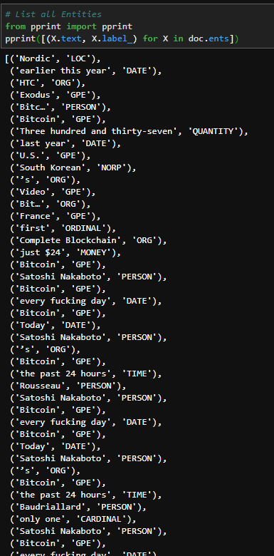

#### ETH NER Cloud

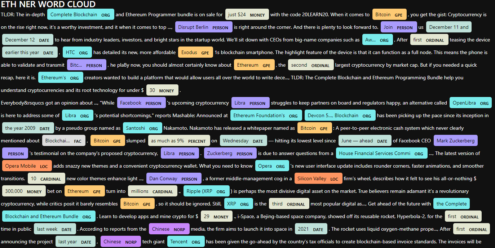

#### ETH Entities List

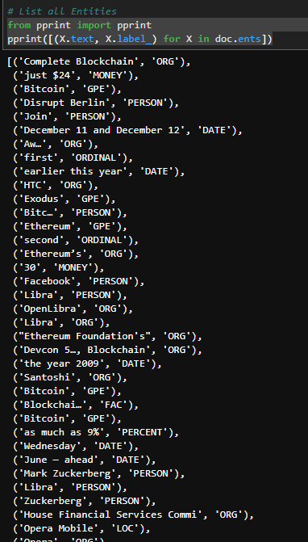

